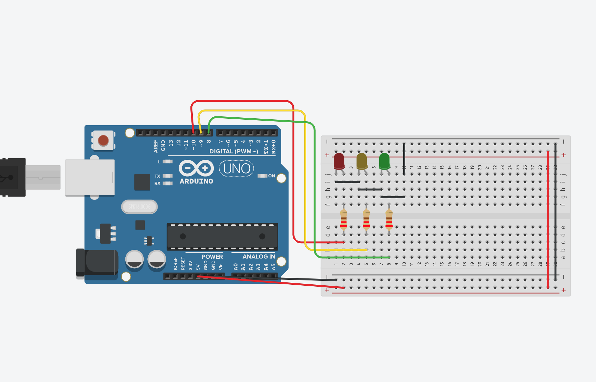
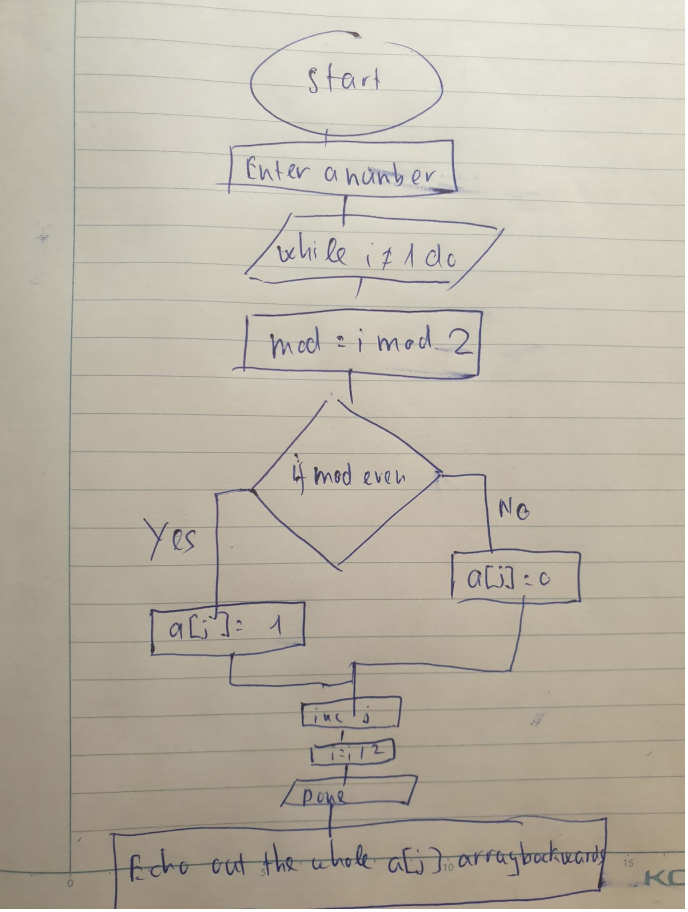

# ComSciUnit2

Binomial and morse
===================


Contents
-----
  1. [Planning](#planning)
  1. [Design](#design)
  1. [Development](#development)
  1. [Evaluation](#evaluation)
  
  
 
Planning
----------
The topic is called Martian Decoder. The year is 2050. Planet exploration is a thing, however, communication is still precarious. The station in the Earth can only communicate using Morse code, the station in the Moon can only communicate in Binary code. Communication with the station in Mars must be provided. Basically what we have to do is work with binary and morse programming: provide a communication system that allow stations to communicate seamlessly using English, but the Keyboard input on each station is limited to 2 push buttons.

This is a very new topic for us. Working with binary and morse code, using a different programming language, and working the with arduino set. At first, we were quite anxious but also very excited about getting to build and program a system. And the first thing I did was to get to know how to build the system, get familiar with arduino programming language, and also how too assemble, connect the lights, buttons, resistors to the arduino Uno3 board.


Design
---------


Development
--------

### 1. Practice with traffic light
  This is the first thing we did that is related to arduino. We had to watch a video on youtube on how to build a traffic light for homework, and start building it and coding it by ourselves.
  
 ````.c
 int red = 10;
int yellow = 9;
int green = 8;

  // put your setup code here, to run once:
  void setup(){
    pinMode(red, OUTPUT); 
    pinMode(yellow, OUTPUT);
    pinMode(green, OUTPUT);
digitalWrite(green, HIGH);
}


void loop() {
 // green off, yellow on for 3 seconds
    digitalWrite(green, LOW);
    digitalWrite(yellow, HIGH);
    delay(3000);

    // turn off yellow, then turn red on for 5 seconds
    digitalWrite(yellow, LOW);
    digitalWrite(red, HIGH);
    delay(5000);

    // red and yellow on for 2 seconds (red is already on though)
    digitalWrite(yellow, HIGH);
    delay(2000);

    // turn off red and yellow, then turn on green
    digitalWrite(yellow, LOW);
    digitalWrite(red, LOW);
    digitalWrite(green, HIGH);
    delay(3000);
    
}
````
  We program and set up mostly everything on Tinkercad.com first before actually using the arduino set to make it. Tinkercad is an online arduino simulation, both setting up the board and coding. This helps us to make sure everything is working perfectly, and also debugging problems if needed. And then when we are done with tinker cad, we use the school's arduino set to set up the actual traffic light ( as we know that it is working normally on tinker cad, we will know that if we do the same thing with the set it should be working normally ). 
  
  The code itself works very easily, what digitalWrite LOW and HIGH is is to turn on and off the lights, delay is to wait for a specific amount of miliseconds before performing the next task. As we learned bash language, modern C ( arduino ) coding seems to be much easier as we already know the concept, how to do things, it is just the code that is written in a different way. This is the traffic light with the actual arduino set:
 
 
  
### 2. Bash and Arduino comparison

  Using the For loops practices that we were given to do on bash, no we are doing it again but with the arduino code. It turns out that there is actually no major differences between the 2 programming language. Here is a coding excersise but it's programming on both of the languages: print out the first 1000 numbers that is divisible by 7.
  
  **For bash:**
````.sh
#!/bin/bash
i=0
for ((n=1;n<=1000;n++))
do
  echo -n $i
  ((i=i+1))
  if [ $i -eq 7 ]; then
    i=0
  fi
done
````
  **For arduino:**
````.c
void setup()
{
  Serial.begin(9600);
  int i=0;
  for (int n=1; n<=1000; n++) {
    Serial.print(i);
     i = i + 1;
    if ( i == 7 ) i=0;
  }
}

void loop()
{
}
````

As you can see, the 2 programs are very similar to each other. The For loop, the If commands works the same way, just some changes in how you write it down. For bash, you don't need to define the variable before start using it, but in Arduino, you have to. Another advantage of bash is we don't need to use ";" ( semicolons ) in our program. In arduino, you have to use it at the end of every command, which can be very annoying for debugging sometimes as you might forget to put it there. Arduino programming language is specialized to program for the board for it to do work, so if we want to use the terminal, we have to have a command to start it first. The terminal is a very helpful function of arduino, especially for finding mistakes in the program or checking what the output sent to the Uno3 board is. 

````.c
void setup() {
}

void loop() {
}
````

This is probably where arduino and bash differs the most. So what is void? Void is basically a type of function that only perform the task inside but doesn't return any value. 
A very interesting and super useful function is the void loop() function. With the void setup command, every code that is put inside of it, when we start the program, only run once, just like the bash program itself. But using the loop, all the codes are repeated forevery unless we press the stop program button. That is why in the traffic light program above, once we press start, all the code in the loop will run, making the traffic lights to consistently turning on and off without having to pressing start again. This is very helpful and significant what arduino gives us

### 3. Binary counting 

After getting familiar with how arduino programming and boarding works, we moved on to some harder tasks: Binary counting using Arduino language. But before that, we learned out to change from decimal to binary. 

**Mathematically, how we convert from decimal to binary is:**

- Write down the decimal number.
- Divide the number by 2.
- Write the result underneath.
- Write the remainder on the right hand side. This will be 0 or 1.
- Divide the result of the division by 2 and again write down the remainder.
- Continue dividing and writing down remainders until the result of the division is 0.
- The most significant bit (MSB) is at the bottom of the column of remainders and the least significant bit (LSB) is at the top.
- Read the series of 1s and 0s on the right from the bottom up. This is the binary equivalent of the decimal number. Here is an outline flow chart for a program to do it:
 
 
 
 **This the arduino program that gives output from 0 to 15 in binary**
 
 
 
 


  


Evaluation
-----------
