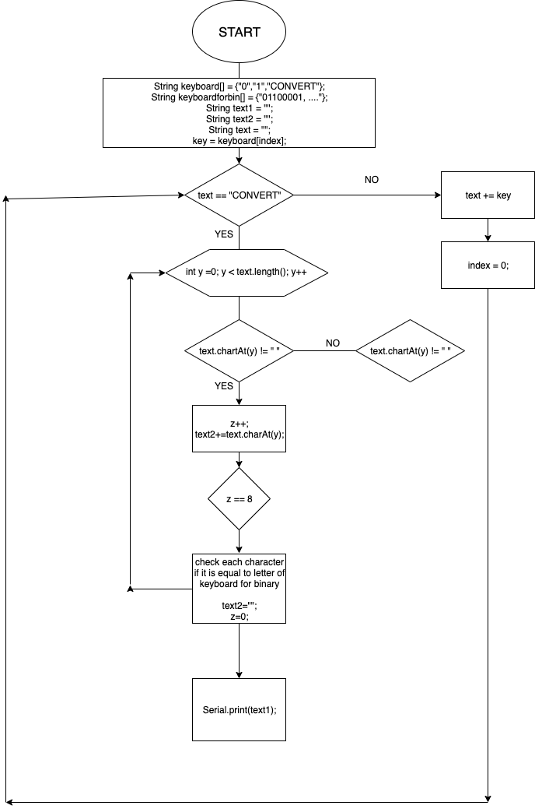
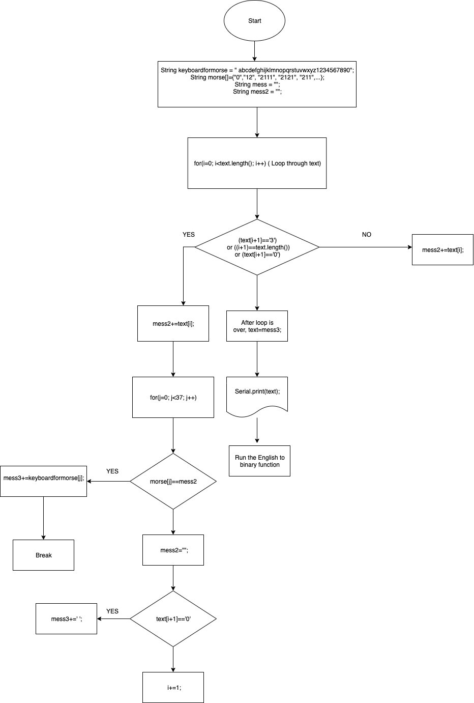
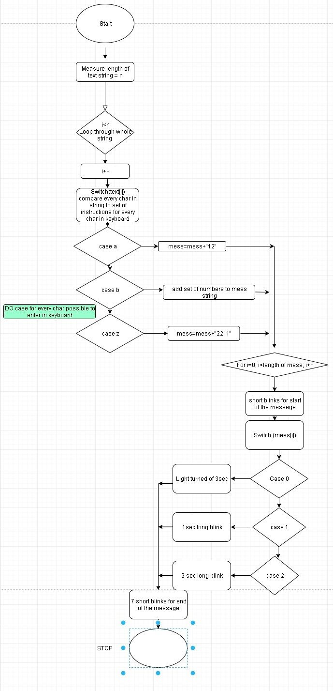

# ComSciUnit2


Martian Decoder
===================


Contents
-----
  1. [Planning](#planning)
  1. [Design](#design)
  1. [Development](#development)
  1. [Evaluation](#evaluation)
  
  
 
Planning
----------
**Identifying problem:**
The topic is called Martian Decoder. The year is 2050. Planet exploration is a thing, however, communication is still precarious. The station in the Earth can only communicate using Morse code, the station in the Moon can only communicate in Binary code. Communication with the station in Mars must be provided. Basically what we have to do is work with binary and morse programming: provide a communication system that allow stations to communicate seamlessly using English, but the Keyboard input on each station is limited to 2 push buttons.

**Solution proposed:**
This is a very new topic for us. Working with binary and morse code, using a different programming language, and working the with arduino set. At first, we were quite anxious but also very excited about getting to build and program a system. And the first thing I did was to get to know how to build the system, get familiar with arduino programming language, and also how too assemble, connect the lights, buttons, resistors to the arduino Uno3 board.

We are seperated into three different stations: earth, mars and moon. What we have to achieve is:
- The user enter the input using english alphabet
- The input is transfered into binary code and sent to the mars
- The mars then trasnfer it back to english and again change the language into morse code, and send the code to the moon station
- Moon station will recieve that morse code and change it back to english
As I am an HL student, we have to do harder tasks. So I decided to join the mars station with Filip, Lingye and Shin. Mars is the hardest station comparing with the two other stations because we have to work all of the  3 different types of language: binary, morse and english. 

**Success criteria:**

The expected outcome of the whole project is to achieve:
	
	1. Communicate with English and binary between Earth and Mars station
	
	2. Communicate with binary, English and morse between Mars and Moon
	
	3. Communicate with morse and English at Moon station
	
	4. Providing an English input system that uses only 2 push buttons
	
	5. Sending messages using only 100W lights and buzzers
	
	6. System is overall easy to understand for the user to use
	
	7. Processing and sending messages should be in miliseconds after the user entered the input
	


Design
---------
There is not much for designing in this topic, as we already got use to the loops and also we don't really use them that much in the chapter, so no flow chart needed. Theres a very helpful website for preparing the curcuit, design the system and also programming the code before actually building it using the arduino set: Tinkercad.com


As you can see, we can add the arduino board, add different parts and engines to it. Not only that, we can also code and basically set up for the whole system before actually using the physical arduino set. The purpose of this is to see if the program is working correctly, if it needs fixing. Before building on the school's arduino set, we always use tinkercad as it is a lot easier to debugg programs, to check if we plugged in something wrong right. For example: if we forget to plug the resistors for the LED lights, the light will burn; but on tinkercad, it reminds you that you should plug it in, which is very helpful. Usually, after getting everything set up, and run several tests that shows expected results, I start working on the 
arduino set, and it is even easier because we can refer to the tinkercad circuit and do everything the same. In the end, it is a very useful and convenient program.

**Usability and HCD***
Usability is according to Techopedia [1] the degree of ease with which a product can be used to achieve their goals. Elegance, clarity, intuitive. Usability assesses the level of difficulty involved in using a user interface
 
Human-centered design [also Human-centred design, as used in ISO standards] is an approach to problem solving, commonly used in design and management frameworks that develops solutions to problems by involving the human perspective in all steps of the problem-solving process [2]

[1] “Usability retrieved from https://www.techopedia.com/definition/4919/usability ( 25 Nov 2019 )
[2] POSMER J, MARS R. “ It’s not you, bad doors are everywhere” 2016. Retrieved ( 25 Nov 2019 )

**Flow diagrams**
Input system:


Binary to English: 



English to Binary:


Morse to English:




English to Morse:




Development
--------

### 1. Practice with traffic light
  This is the first thing we did that is related to arduino. We had to watch a video on youtube on how to build a traffic light for homework, and start building it and coding it by ourselves.
  
 ````.c
 int red = 10;
int yellow = 9;
int green = 8;

  // put your setup code here, to run once:
  void setup(){
    pinMode(red, OUTPUT); 
    pinMode(yellow, OUTPUT);
    pinMode(green, OUTPUT);
digitalWrite(green, HIGH);
}


void loop() {
 // green off, yellow on for 3 seconds
    digitalWrite(green, LOW);
    digitalWrite(yellow, HIGH);
    delay(3000);

    // turn off yellow, then turn red on for 5 seconds
    digitalWrite(yellow, LOW);
    digitalWrite(red, HIGH);
    delay(5000);

    // red and yellow on for 2 seconds (red is already on though)
    digitalWrite(yellow, HIGH);
    delay(2000);

    // turn off red and yellow, then turn on green
    digitalWrite(yellow, LOW);
    digitalWrite(red, LOW);
    digitalWrite(green, HIGH);
    delay(3000);
    
}
````
  We program and set up mostly everything on Tinkercad.com first before actually using the arduino set to make it. Tinkercad is an online arduino simulation, both setting up the board and coding. This helps us to make sure everything is working perfectly, and also debugging problems if needed. And then when we are done with tinker cad, we use the school's arduino set to set up the actual traffic light ( as we know that it is working normally on tinker cad, we will know that if we do the same thing with the set it should be working normally ). 
  
  In the beginning of the program, we have to define the colour of the lights according to what pin they are plugged in, and also declare if it is an input or and output for the computer to know. For example: the red led is plugged into pin number 10 on the Arduino board, so we define it as the 10 pin, as an OUTPUT. We declare INPUT for things like buttons, sensors,...; and OUTPUT for lights, lcd screen,...
  
  The code itself works very easily, what digitalWrite LOW and HIGH is is to turn on and off the lights, delay is to wait for a specific amount of miliseconds before performing the next task. As we learned bash language, modern C ( arduino ) coding seems to be much easier as we already know the concept, how to do things, it is just the code that is written in a different way. This is the traffic light with the actual arduino set:
 
 
  
### 2. Bash and Arduino comparison

  Using the For loops practices that we were given to do on bash, no we are doing it again but with the arduino code. It turns out that there is actually no major differences between the 2 programming language. Here is a coding excersise but it's programming on both of the languages: print out the first 1000 numbers that is divisible by 7.
  
  **For bash:**
````.sh
#!/bin/bash
i=0
for ((n=1;n<=1000;n++))
do
  echo -n $i
  ((i=i+1))
  if [ $i -eq 7 ]; then
    i=0
  fi
done
````
  **For arduino:**
````.c
void setup()
{
  Serial.begin(9600);
  int i=0;
  for (int n=1; n<=1000; n++) {
    Serial.print(i);
     i = i + 1;
    if ( i == 7 ) i=0;
  }
}

void loop()
{
}
````

As you can see, the 2 programs are very similar to each other. The For loop, the If commands works the same way, just some changes in how you write it down. For bash, you don't need to define the variable before start using it, but in Arduino, you have to. Another advantage of bash is we don't need to use ";" ( semicolons ) in our program. In arduino, you have to use it at the end of every command, which can be very annoying for debugging sometimes as you might forget to put it there. Arduino programming language is specialized to program for the board for it to do work, so if we want to use the terminal, we have to have a command to start it first. The terminal is a very helpful function of arduino, especially for finding mistakes in the program or checking what the output sent to the Uno3 board is. 

````.c
void setup() {
}

void loop() {
}
````

This is probably where arduino and bash differs the most. So what is void? Void is basically a type of function that only perform the task inside but doesn't return any value. 
A very interesting and super useful function is the void loop() function. With the void setup command, every code that is put inside of it, when we start the program, only run once, just like the bash program itself. But using the loop, all the codes are repeated forevery unless we press the stop program button. That is why in the traffic light program above, once we press start, all the code in the loop will run, making the traffic lights to consistently turning on and off without having to pressing start again. This is very helpful and significant what arduino gives us

### 3. Binary counting 

After getting familiar with how arduino programming and boarding works, we moved on to some harder tasks: Binary counting using Arduino language. But before that, we learned out to change from decimal to binary. 

**Mathematically, how we convert from decimal to binary is:**

- Write down the decimal number.
- Divide the number by 2.
- Write the result underneath.
- Write the remainder on the right hand side. This will be 0 or 1.
- Divide the result of the division by 2 and again write down the remainder.
- Continue dividing and writing down remainders until the result of the division is 0.
- The most significant bit (MSB) is at the bottom of the column of remainders and the least significant bit (LSB) is at the top.
- Read the series of 1s and 0s on the right from the bottom up. This is the binary equivalent of the decimal number. Here is an outline flow chart for a program to do it:
 
 
 
 **This the arduino program that gives output from 0 to 15 in binary**
  
 
 
 ````.c
 int i=0;
void setup()
{
  pinMode(9, OUTPUT);
  pinMode(10,OUTPUT);
  pinMode(11,OUTPUT);
  pinMode(12,OUTPUT);
  for (i=0; i<=15; i++) {
    if ( i % 2 > 0 ) {
      digitalWrite(9,HIGH);
    }
    if ( i % 4 > 1 ) {
       digitalWrite(10,HIGH);
    }
    if ( i % 8 > 3 ) {
       digitalWrite(11,HIGH);
    }
    if ( i % 16 > 7 ) {
      digitalWrite(12,HIGH);
    }
    delay(1000);
     digitalWrite(9,LOW);
     digitalWrite(10,LOW);
     digitalWrite(11,LOW);
     digitalWrite(12,LOW);
    delay(200);
        
  }
    
}

void loop()
{
}
````
This program gives the output of the first 16 decimals in binary. To understand how this works, first we should look at the decimal to binary table:


We can actually see a pattern from the binary side of the table:
- 4th column: 0 and 1 switches every time ( 0 1 0 1 )
- 3rd column: 0 and 1 switches every 2 times ( 0 0 1 1 0 0 )
- 2nd column: 0 and 1 switches every 4 times ( 0 0 0 0 1 1 1 1 )
- 1st column: 0 and 1 switches every 8 times ( 0 0 0 0 0 0 0 0 1 1 1 1 1 1 1 1 )

From that, we can easily write the code as we have found the pattern between those binary numbers, just like the code above.
This is the actual system using the arduino set:


### 4. Different types of variables in Arduino
 In Arduino, there are various types of variables that can store different valus. That is why we have to define that variable type before start working with it, unlike bash. 
 
 
 
 The reason we should assign the variables is to increase the efficiency for the computer's RAM. Because for example, if we want a variable that can store only 1 or 0 to display binary, there is no need to use float or word for it, we can just use boolean, which is more efficient for the computer.
 
 ### 5. Binary gates
  Binary gates is a quite complicated topic. It is basically an idealized or physical device implementing a Boolean function; that is, it performs a logical operation on one or more binary inputs and produces a single binary output. These mostly all the commands and equation of logic gates: 


This is the example for the output that each of the gates give


This is very helpful because for instance we work with a list of inputs 2 buttons or more, instead of having to use several lines of IF commands, we can summarize it on 1 line using only one equaion. It is very hard to fully understand and get use to doing it, it involves:
* Putting the input and output into a specific type of table
* Work out the equation for individual terms
* Putting those terms together to create the complete equation
* Transform the equation from math language into programming language

For example, I used one coding exercise and try to use it 2 ways: manually and uing binary gates, the question is to create the output with the following inputs:


**The normal way of doing it:**
````.c
int decimal;
void loop()
{
 decimal = digitalRead(butA)*pow(2,1);
 decimal += digitalRead(butB)*pow(2,0);
  
 if (decimal == 0) {
    digitalWrite(led1, HIGH);
   	digitalWrite(led2, LOW);
  }
  if (decimal == 1 || decimal == 2) {
    digitalWrite(led1, LOW);
    digitalWrite(led2, HIGH);
  }
  if (decimal == 3) {
    digitalWrite(led1, HIGH);
    digitalWrite(led2, HIGH);
  }
  
}
````
What I did here was at first I convert the binary into decimal so that it is easier to work with, and then from then use if as a condition to get specific outcomes.

**Using binary gates:**
````.c
void loop()
{
	bool A = digitalRead(butA);
  	bool B = digitalRead(butB);
  	bool eq1 = (!A & !B) | (A & B);
  	bool eq2 = B | A;
  	digitalWrite(led1, eq1);
  	digitalWrite(led2, eq2);
}
````
As you can see, it is a lot shorter. It can actually be written in 2 lines of code only, but because I want to keep it organized, I assigned name for each value and equation so it is easier to understand. The symbols "!", "&","|"... are the logic gates, it represents NOT, AND, OR,... So basically, it works the same as all the if commands but put into a very simplified line, thats what makes binary gates so convenient when utilized.

Similar to this exercise, we also did another 2 tables: one is similar to the first one, and one with 3 inputs instead of 2 inputs. For the ones that is with 3 inputs, it is a little more complicated as we have to now work with a larger varieties of situation. So the binary equation are usually a bit longer, but still works the exact same way.

````.c
  bool eqA = ( (!C) & (!A) ) | B | ( C & A );
  bool eqB =  ( A & C ) | ( (!B) & (!C) );
  bool eqC = ( (!C) & (!A) ) | ((!C) & B));
````

### 6. Presenting numbers using LEDs
We are currently working on how to show a number by pressing buttons. Like the number you see in calculators, timers,... are all programmed this way, and we will find out how it works.


We have made an input and output table for the inputs and outputs. Basically, the buttons will display number from 1 to 7. This is the table:

After coming up with this input and output, we have to use what we learned about binary gates to create a bitwise equation for each of the LED lights. To know the equations for a binary input and output system, first we create a table ( I take light b as an example). And then come up with the equation using our binary gates knowledge:


After completing all the equation for the LED lights, we made a ciruit on tinkercad again to check if it is working normally. This takes a huge amount of time as we have to connect all the wires and setting up for 7 different lights.


````.c

void loop()
{
  bool A = digitalRead(butA);
  bool B = digitalRead(butB);
  bool C = digitalRead(butC);

  bool eqA = ( (!C) & (!A) ) | B | ( C & A );
  bool eqB =  ( A & C ) | ( (!B) & (!C) );
  bool eqC = ( (!C) & (!A) ) | ((!C) & B);
  bool eqD = (!C & !A) | (!A & B | (!C & B | (A & !B & C);
  bool eqE = C | (!A & !B) | A;
  bool eqF = !B | ( !A & !C ) | ( A & C);
  bool eqG = B | (A & !B);
 
  digitalWrite(ledA, eqA);
  digitalWrite(ledB, eqB);
  digitalWrite(ledC, eqC);
  digitalWrite(ledD, eqD);
  digitalWrite(ledE, eqE);
  digitalWrite(ledF, eqF);
  digitalWrite(ledG, eqG);
}
````
The thing that takes us the most time is how to use the binary equations and bitwise symbols in arduino, but we managed to figure it out in the end. As the program were tested and worked perfectly as we expected to, based on this circuit, we this up using an actual arduino set.


It took us a lot of time to get all the wires connected, plugged in to the led lights, inserted in the right place. There were problems such as: not enough male to female cables in arduino box, plugs were loose, wrong resistors,... But in the end we managed to sort things out, and it works perfectly.


### 7. Designing input system for 2 buttons

**Step 1: Finding the way the system works that has the most efficiency**
This for me seems to be the hardest step of the program: how to find the right system. Of course, we have only 2 buttons, but we can decide how the program works and what the buttons will choose. There are many different approaches to the system, and finding the most efficient one is not easy at all.

After thinking of a lot of ideas, I have thought about my own, but that requires a lot of function for the user to remember, which does not meet one of our criteria. In the end, I decided to use a very simple approach to the problem: one buttong is for changing to the letter/number that you want, and the other button is to either  delete or send the message. The most difficult thing I encountered is that as we have to put the program inside of the void loop, the program runs every milisecond, which is very hard to read the input from the buttons and give output to the lcd. That is why we are going to use something called interrupts.

***Interrupts:**
An Interrupt's job is to make sure that the processor responds quickly to important events. When a certain signal is detected, an Interrupt (as the name suggests) interrupts whatever the processor is doing, and executes some code designed to react to whatever external stimulus is being fed to the Arduino. Once that code has wrapped up, the processor goes back to whatever it was originally doing as if nothing happened!

But because of that, we cannot have functions like if the user press 2 button at the same time, the program will perform a special task, this is because there can only be 1 interrupt runs at a time. 

**Step 2: Coding**

Working with interrupts are quite complicated at first for me because we have to use a lot of unfamiliar functions and variables, but we soon understood it better as we get to see example codes. We are given an uncompleted program for the input system and out task is to complete it. After completing the program and testing on tinkercad, it works perfectly and also I understood how interrupts works a lot better. 
````.c
String text = "";
int index = 0; 
// add all the letters and digits to the keyboard

String keyboard[38]={"a", "b", "c", "d", "e", "f", "g", "h", "i", "j", "k", "l", "m", "n", "o", "p", "q", "r", "s", "t", "u", "v", "w", "x", "y", "z", "0", "1", "2", "3", "4", "5", "6", "7", "8", "9", "SENT", "DEL"};
int numOptions = 38; //size of keyboard 

void setup()
{
  Serial.begin(9600);
  attachInterrupt(0, changeLetter, RISING);//button A in port 2
  attachInterrupt(1, selected, RISING);//button B in port 3
}

void loop()
{
  Serial.println("Option (Select:butB, Change:butA): " + keyboard[index]);
  Serial.println("Message: "+ text);
  delay(100);
}

//This function changes the letter in the keyboard
void changeLetter(){
  index++;
    //Explain what the functionality of the if condition below 

  if(index>numOptions){
  	index=0; //loop back to first row
  } 
}

void selected() {
  String key=keyboard[index];
	if ( key == "DEL" ) {
	int len = text.length();
	text.remove(len-1);
	} else if ( key == "SEND") {
	Serial.print('Message sent');
	text = "";
	} else {
 	text = text +  key;
	}
	index=0; 

}
````
The only problem with the program is that we are displaying the output using the serial monitor, which the user will not be able to see. So the approach to this problem is to use an lcd display to display the choices and also output for the user. 

**Step 3: Using lcd display**

The lcd are quite complicated to be plugged into the board, as it consists of multiple wires connecting to different ports, so we have to connect it based on the example on TinkerCad


And this is what we accomplished to make using the actual Arduino set


**Step 4: Finishing the code**
If we use the lcd display, we cannot use commands like Serial.print; Serial.begin anymore, and we have to use the special commands for the lcd display, but it is very similar:
````.c
lcd.clear();
  lcd.setCursor(0, 0);
  lcd.print(keyboard[index]);
  lcd.setCursor(0, 1);
  lcd.print(text);
  delay(100);
````
After finishing the code and tested it, it finally works! We were able to create an input system for the program. But this is only the start or the program itself, we still have lots of things to add and fix in this system. After figuring out what needed to be added, we came up with a final system.
````.c
String keyboard[]={" ", "SENT BINARY","SENT MORSE", "MORSE TO BINARY", "BINARY TO MORSE", "1", "2", "3", "4", "5", "6", "7", "8", "9", "0","a", "b", "c", "d", "e", "f", "g", "h", "i", "j", "k", "l", "m", "n", "o", "p", "q", "r", "s", "t", "u", "v", "w", "x", "y", "z", "DEL"};
````
This is the final keyboard that we have. Instead of only having sent and delete, we've included: 
- Sent binary ( Input: English; Output: Binary ): This is for our moon team to send our own messages to the earth team
- Sent mrose ( Input: English; Output: Morse): This is for our moon team to send our own messages to the mars team
- Morse to binary ( Input: Morse; Output: Binary ): This to convert the message that mars wanted to send into binary so that the earth team can read it
- Binary to morse ( Input: Binary; Output: Morse): This is to convert the message that earth wanted to send into morse so that the mars team can read it
With the help of Dr Ruben, created a better, more efficient and accurate code for the input system:
**Changing letters:**
````.c
void changeLetter(){
  static unsigned long last_interrupt_time = 0;
  unsigned long interrupt_time = millis();
  if (interrupt_time - last_interrupt_time > 200)
  {
  
    last_interrupt_time = interrupt_time;// If interrupts come faster than 200ms, assum
    index++;
      //check for the max row number
    if(index==numOptions){
      index=0; //loop back to first row
    } 
 }
}
````
Every time the right button is clicked, index the program will read that interrupt, and hence increase the index. By increasing the index, the array switched to the next number, and then display it on the lcd. The if function is for when the user loop through the whole array, instead of keep increasig the index, we set the index to be zero ( the first element of the array) and therefor loops back to the first letter.
````.c
void selected(){
  static unsigned long last_interrupt_time = 0;
  unsigned long interrupt_time = millis();
  if (interrupt_time - last_interrupt_time > 200)
  {
  
    last_interrupt_time = interrupt_time;// If interrupts come faster than 200ms, assum
    
    String key = keyboard[index];
    if (key == "DEL")
    {
      int len = text.length();
      text.remove(len-1);
    }
    else if(key == "SENT BINARY")
    {
      EtoB();
      turnOnOff();
      sentbin();
      turnOnOff();
      text="";
    } else if(key == "SENT MORSE"){
    	sentmorse();
    }
    else if(key== "MORSE TO BINARY"){
      MtoB();
    }
    
    else{
      text += key;
    }
    index = 0; //restart the index
  }
}
````
This function runs when the user press the left button, which is the select button. Basically, how this works is, when the user chooses a letter/ number, that letter will be added to a string called "text", and as the user keep choosing the letters, it will keep being added to that string. If the user chooses delete, the program will remove the last letter of the text, and therefore deleting that letter. When the user choose one of the commands like: "morse to binary",... The program will stop adding letter, and perform the function based on what is input into the text, that is why there are multiple if else commands, those are for different functions with different purposes. If the user didn't choose any of that, that means that what the user chosen has to be either a letter or number, and there for adding it to the text ( else { text+=key}). The index = 0 is for when the user select anything, the program will automatically loops back to the first element of the array.

After finishing with the input system, we had to figure out the hardest part, which is actually working with transvering binary and morse code.

### 8. Planning
Because we are the middle station, we have to be able to both read and send morse, binary and english. So we decided to create 4 functions inside the program: converint english to morse, morse to english, binary to morse, and binary to english. With these 4 functions, we can do everything that we needed to, sending our own messages to the other 2 stations, send the message from earth to mars and vice versa. As there are lots of functions, we decided to split the group into 2 parts : morse part and english part. One problem is, once we complete the program is done seperately, when putting it together, because of the overflow of code for the interrupts, the program did not run correctly. So we decided to cut out 1 part of the program and make a separate one: the binary to english program.


### 9. Binary part of the system
Lingye and Tuan worked on the binary part of the system, and my and Filip worked on the other part. This is their part of the program:
**English to binary:**
````.c
void EtoB(){

for(int i=0; i<text.length(); i++){

   char myChar = text.charAt(i);
 
    for(int i=7; i>=0; i--){
      bna = bitRead(myChar,i);
      chch += bna; 
    }
}
}

  
void sentbin(){
    for(int x=0; x < chch.length(); x++){
      char myChar1 = chch.charAt(x);
      if(myChar1 == '0'){
        digitalWrite(led1, LOW);
        blink();
        delay(500);
      } else if(myChar1 == '1'){
        digitalWrite(led1, HIGH);
        blink();
        delay(500);
      } else {
        turnOff();
      }
    }
  }

void blink(){
  digitalWrite(led2, HIGH);
  delay(500);
  digitalWrite(led2, LOW);
  delay(500);
}

void turnOnOff(){
 digitalWrite(led1, HIGH);
 digitalWrite(led2, HIGH);
 delay(500);
 digitalWrite(led1, LOW);
 digitalWrite(led2, LOW);
 delay(500);
}

void turnOff(){
 digitalWrite(led1, LOW);
 digitalWrite(led2, LOW);
 delay(500);
}
````
The program begins when the user chose the option: "Sent binary"

**Binary to English:
````.c
void bintoeng(){
  for (int y = 0; y < text.length(); y++){
    if(text.charAt(y) != ' '){
      z++;
      text2+=text.charAt(y);
      if(z == 8){
        check();
      	text2="";
        z=0;
      }
    } else {
    	text2+= " ";
    }
  }
 Serial.print(text1); 
}

void check(){
    if (text2 == "01100001") {
           text1=text1+"a";
    } else if (text2 == "01100010") {
           text1=text1+"b";
    } else if (text2 == "01100011") {
           text1=text1+"c";
    } else if (text2 == "01100100") {
           text1=text1+"d";
    } else if (text2 == "01100101") {
           text1=text1+"e";
    } else if (text2 == "01100110") {
           text1=text1+"f";
    } else if (text2 == "01100111") {
           text1=text1+"g";
    } else if (text2 == "01101000") {
           text1=text1+"h";
    } else if (text2 == "01101001") {
           text1=text1+"i";
    } else if (text2 == "01101010") {
           text1=text1+"j";
    } else if (text2 == "01101011") {
           text1=text1+"k";
    } else if (text2 == "01101100") {
           text1=text1+"l";
    } else if (text2 == "01101101") {
           text1=text1+"m";
    } else if (text2 == "01101110") {
           text1=text1+"n";
    } else if (text2 == "01101111") {
           text1=text1+"o";
    } else if (text2 == "01110000") {
           text1=text1+"p";
    } else if (text2 == "01110001") {
           text1=text1+"q";
    } else if (text2 == "01110010") {
           text1=text1+"r";
    } else if (text2 == "01110011") {
           text1=text1+"s";
    } else if (text2 == "01110100") {
           text1=text1+"t";
    } else if (text2 == "01110101") {
           text1=text1+"u";
    } else if (text2 == "01110110") {
           text1=text1+"v";
    } else if (text2 == "01110111") {
           text1=text1+"w";
    } else if (text2 == "01111000") {
           text1=text1+"x";
    } else if (text2 == "01111001") {
           text1=text1+"y";
    } else if (text2 == "01111010") {
           text1=text1+"z";
    } 
}
````
This program has to be seperated from the main program because it causes overload, but as a separate program, it works completely fine

### 10. Morse part of the system
Filip and I worked on the morse part of the system. The only tricky part for us is to come up with a lighting system that actually works because we are using 1 light and its totally time based so mistakes can easily be made. So first, we planned out the system together, and as morse code has 2 syntaxs: dash and dot, we assigned when different time for different syntaxes, and also pauses between letters and words.

**English to Morse part ( Filip's ):**
````.c
for(i=0; i<text.length(); i++) {
        switch(text[i]) {
          case ' ':
          mess+="0";
          break;
          case 'A': 
           mess=mess+"12";
          break;
          case 'B':
            mess=mess+"2111";
          break;
          case 'C':
            mess=mess+"2121";
          break;
          case 'D':
          mess+="211";
          break;
          case 'E':
          mess+="1";
          break;
          case 'F':
          mess+="1121";
          break;
          case 'G':
          mess+="221";
          break;
          case 'H':
          mess+="1111";
          break;
          case 'I':
          mess+="11";
          break;
          case 'J':
          mess+="1222";
          break;
          case 'K':
          mess+="212";
          break;
          case 'L':
          mess+="1211";
          break;
          
          case 'M':
          mess+="22";
          break;
          
          case 'N':
          mess+="21";
          break;
          
          case 'O':
          mess+="222";
          break;
          
          case 'P':
          mess+="1221";
          break;
          
          case 'Q':
          mess+="2212";
          break;

          case 'R':
          mess+="121";
          break;

          case 'S':
          mess+="111";
          break;

          case 'T':
          mess+="2";
          break;

          case 'U':
          mess+="112";
          break;

          case 'V':
          mess+="1112";
          break;

          case 'W':
          mess+="122";
          break;

          case 'X':
          mess+="2112";
          break;

          case 'Y':
          mess+="2122";
          break;

          case 'Z':
          mess+="2211";
          break;

          case '1':
          mess+="12222";
          break;

          case '2':
          mess+="11222";
          break;

          case '3':
          mess+="11122";
          break;

          case '4':
          mess+="11112";
          break;

          case '5':
          mess+="11111";
          break;

          case '6':
          mess+="21111";
          break;

          case '7':
          mess+="22111";
          break;

          case '8':
          mess+="22211";
          break;

          case '9':
          mess+="22221";
          break;

          case '0':
          mess+="22222";
          break;
        }
        mess+="3";
      }
      Serial.print(mess);
       for(i=0; i<7; i++) {
        blinkLight(300, 300);
      }
      for(i=0; i<mess.length(); i++) {
        switch (mess[i]) {
          case '0':
          delay(3000);
          break;
          
          case '1':
          blinkLight(1000, 1000);
          break;
          
          case '2':
          blinkLight(3000, 1000);
          break;
          
          case '3':
          delay(1000);
          break;
        }
      }
      
      for(i=0; i<7; i++) {
        blinkLight(300, 300);
      }
      		
          
      text="";
````
Basically, how this works is that we will loop through the string and for every case of the letter ( a, b, c...) we add the value to the new string: dot is 1, dash is 2, between letters is 3, and between words is 0. After that we read that string and the light will turn on off depending on those numbers.

***Morse to English ( My part ):***

This is the part of the system that I complete by myself: converting from morse back to english. When doing this, I realized that if I do this, I will have to write down all the cases out all over again, which you can see doesn't look quite organize. So I came up with an idea: using 2 arrays for the program. I do understood that instead of using 2 arrays we can use the matrix but in order to keep it simple and easier to understand, I used 2 arrays instead.

*Defining the needed variables and arrays:*
````.c
String keyboardformorse = " abcdefghijklmnopqrstuvwxyz1234567890";
String morse[]={"0","12", "2111", "2121", "211", "1", "1121", "221", "1111", "11", "1222", "212", "1211", "22", "21", "222", "1221", "2212", "121", "111", "2", "112", "1112", "122", "2112", "2122", "2211", "12222", "11222", "11122", "11112", "11111", "21111", "22111", "22211", "22221", "22222"};
String mess2 = "";
String mess3= "";
````
I have also made the orders of the 2 arrays to be correct. For example: C to morse is dash dot dash dot, and so keyboardformorse[4]=c and morse[4]=2121 which is dash dot dash dot, works the same way for every other number and letter in the alphabet
*The morse to english function:*
````.c
 void MtoB() {
    for(i=0; i<text.length(); i++) {
      if((text[i+1]=='3') || ((i+1)==text.length())||(text[i+1]=='0')){
        mess2+=text[i];
        for(j=0; j<37; j++) {
          if(morse[j]==mess2) {
            mess3+=keyboardformorse[j];
            break;
          }
        }
        mess2="";
        if (text[i+1]=='0'){
          mess3+=' ';
        }
          i+=1; 
        
        }
      else {
      	mess2+=text[i];
      }
      
    } 
````
This is what the function looks like. Basically, dot is 1, dash is 2, theres a 3 between letters and a 0 between words. In order to read this, I have to find the 3 inside the text, if I find it, I will know that the words before it forms a letter. For example: if I input 123231, I will know that the three words are 12, 2, 1 which is a, t and e and therefore forms the word "ate". And the same case will happen with the "0", because at the end of each word , there will not be any "3", there will only be spaces ( which is 0 ) so we also have to include that inside the if function. So inside this functions, how it works is:

- Loops through the text that the user entered
- Keep adding each word to the mess2 string at a time per loop until the next letter is either a 3, a 0 or the current letter is the last letter of the string
- When it satisfies the if function, the program will add the current word to the string mess2 and then start looping through the morse[] array. This array includes all the morse codes.
- If the program finds the morse code that matches the mess2 string, then it will add the corresponding english letter ( using the keyboardformorse[] array) to another string called mess3
- If the program reads a "0" then it will add a space to mess3 string because 0 means space between each word.
- The loop will keep running like this throughout the whole text that the user entered 

**The converted morse into English is what is inside the mess3 string, and the message will be printed out to the serial monitor. But not only that, because our main purpose is to help sending messages from mars station back to earth station.
In order for that to happen, we have to again convert that mess3 message from english to binary for the earth station to read. In order to do that, I simply assigned the main text variable= mess3 and then run the English to Binary function from Tuan and Lingyes program, and the message will be converted and display in the lights turning on and off, and the earth can now see the message**
````.c
text=mess3;
  Serial.print(text);
  EtoB();
  turnOnOff();
  sentbin();
  turnOnOff();
  text="";
  mess3="";
````


Evaluation
-----------
